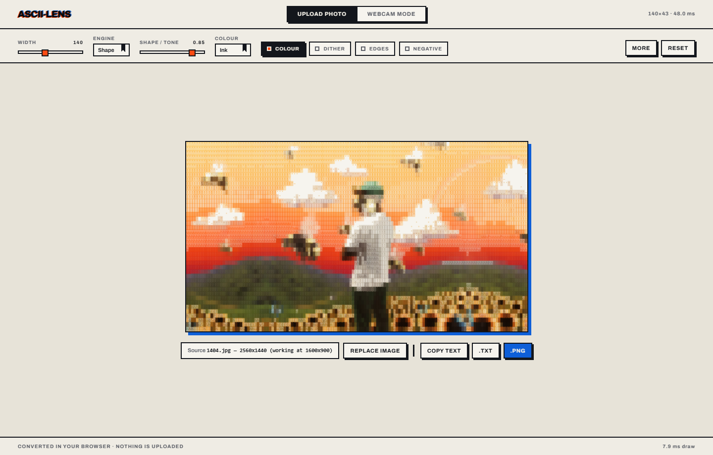

# ASCII-Lens

Turn a photo or your webcam into ASCII art. Everything runs in the browser —
no upload, no server, no account.

**Live: [ascii-lens.vercel.app](https://ascii-lens.vercel.app)**



- **Three conversion engines.** A luminance ramp, a shape matcher that compares
  each cell's ink pattern against every glyph's bitmap, and a "classic" mode
  reproducing the approach most other converters use, for honest comparison.
- **Live webcam** at 60fps, with front/rear switching on phones.
- **Colour, dithering, Sobel edge strokes**, and ramps derived by measuring
  real glyph coverage rather than by tradition.
- **Export** to clipboard, `.txt`, or `.png`.

Built in four phases, each one measuring rather than assuming — see
"What the testbed established" below for the numbers that changed the design.

## Quick start

```bash
npm install
npm test                                    # 60 unit assertions

# Phase 3 - the app
npm run dev                                 # http://localhost:3000
npm run build                               # production build

# Phase 2 - dev playground (measurement rig, not the product)
npm run play                                # http://localhost:5173
npm run verify                              # 45 playground e2e checks
npm run verify:mobile                       # 34 checks on iPhone (WebKit) + Pixel

# Ramp tooling
npm run ramp -- -n 16                       # build a ramp by measuring glyph ink
npm run ramp -- --presets                   # score the built-in ramps

# Phase 1 - CLI testbed
npm run ascii -- samples/icarus.jpg         # prints to terminal, writes out/
npm run compare -- samples/1404.jpg         # contact sheet: every ramp x mode
npm run compare -- samples/1404.jpg --levels  # tone-curve sweep
npm run fixtures                            # regenerate procedural test images
```

## Layout

```text
src/lib/          the engine — no DOM, no filesystem, no globals
  types.ts          RgbaImage / AsciiOptions / AsciiResult + defaults
  ramps.ts          character ramps and luminance -> index mapping
  sample.ts         area-average downsampling + aspect correction
  luminance.ts      perceptual luma, auto-levels, gamma
  dither.ts         Floyd-Steinberg over the character grid
  edges.ts          Sobel -> | / - \ strokes
  asciiConvert.ts   orchestrator + public surface
src/render/       output renderers
  ansi.ts           AsciiResult -> 24-bit colour terminal string
  asciiToCanvas.ts  AsciiResult -> any Canvas2D context (Node AND browser)
app/              Next.js App Router — layout, page, Risograph theme
components/       ModeSwitcher · ControlBar · ImageDropzone · WebcamPanel
                  AsciiStage · ui/{Press,Field}
lib/              options, useFrameSource (source lifetime + cancellation)
src/browser/      shared browser modules — sources, renderers, exports
                  (used by BOTH the app and the playground)
playground/       Phase 2 browser testbed (Vite, no framework)
  index.html        mode switcher, controls, output stage
  main.ts           state, render loop, mode switching, wiring
  sources.ts        FrameSource: file upload and getUserMedia
  renderers.ts      the two display backends, DOM <pre> vs canvas
  exports.ts        clipboard, .txt, .png
cli/              Node-only adapters and entry points
tests/            vitest suite + procedural fixtures + playwright e2e
samples/          input images (gitignored — personal photos)
out/              generated output (gitignored)
```

The split matters: **`src/lib` and `src/render` are platform-agnostic** and get
copied into the Next.js app untouched in Phase 3. Only `cli/` knows about Node,
and only `playground/` knows about the DOM. The playground imports the engine
with no adaptation at all, which is the property Phase 3 depends on.

```ts
import { convert } from './src/lib/asciiConvert.js';

// Browser:  convert(ctx.getImageData(0, 0, w, h), { cols: 120 })
// Node:     convert(await readImage('photo.jpg'), { cols: 120 })
const { text, chars, colors } = convert(image, { cols: 120, ramp: 'blocks' });
```

## Options

| Option | Default | Notes |
|---|---|---|
| `cols` | — | output width in characters |
| `ramp` | `simple` | `simple`, `detailed`, `blocks`, or any literal string |
| `charAspect` | `0.55` | Consolas at line-height 1. **Measure the real font instead of trusting this** — see Phase 2 findings |
| `invert` | `false` | reverses the ramp for dark-on-light rendering |
| `autoLevels` | `true` | percentile contrast stretch |
| `clip` | `0.01` | fraction clipped from each histogram end |
| `gamma` | `1` | `<1` brightens midtones, `>1` darkens |
| `dither` | `false` | Floyd-Steinberg error diffusion |
| `edges` | `false` | Sobel edge strokes |
| `edgeThreshold` | `0.5` | tuned; see below |
| `color` | `false` | emit per-cell RGB |

## What the testbed established

Measured, not assumed:

- **`blocks` is the best ramp for photographs**, `simple` is a close second,
  and **`detailed` is worse than both** — the classic 70-character ramp is not
  actually ordered by perceived ink density, so it reads as noise. See
  "Known issues".
- **Auto-levels earns its default.** Without it most photos collapse into a
  few midtone characters. `gamma 1.0` + `clip 0.01` beat the alternatives on
  the sweep.
- **`edgeThreshold` 0.35 was too low** — it turned ~49% of non-blank cells
  into strokes on a high-contrast source, replacing the image rather than
  accenting it. Raised to `0.5` (~23%).
- **The generic `monospace` font family does not resolve to a fixed-pitch
  face** under `@napi-rs/canvas`; glyph advances came back uneven. The PNG
  renderer names real fonts and verifies uniform advances at startup.
- **Conversion is not the real-time bottleneck.** A 640x480 frame at 120 cols
  with colour + dither + edges all enabled costs **1.44 ms**, under 9% of a
  60fps budget.

### Phase 2 — measured in a real browser

44 end-to-end checks run against headless Chromium (`npm run verify`), using
Chromium's fake media device so Webcam Mode is genuinely exercised, not stubbed.

**Renderer benchmark** — median of 16 warm frames, 1600x900 source, two runs:

| cols | mode | convert | DOM `<pre>` | canvas |
|---:|---|---:|---:|---:|
| 120 | plain | 3.2-3.4 ms | **0.1 ms** | 0.2-0.3 ms |
| 200 | plain | 3.5-3.6 ms | **0.1 ms** | 0.4 ms |
| 300 | plain | 3.9-4.1 ms | **0.2 ms** | 0.7-0.8 ms |
| 120 | colour | 3.3-3.6 ms | 5.5-6.2 ms | **3.7-3.9 ms** |
| 200 | colour | 3.8-4.0 ms | 16.6-17.5 ms | **9.8-10.2 ms** |
| 300 | colour | 4.4-4.7 ms | 39.6-43.8 ms | **30.3-30.6 ms** |

This **overturned the Phase 1 prediction** that DOM rendering would be the
bottleneck:

- **In plain mode the DOM wins outright.** `pre.textContent = text` is a single
  write; the canvas has to `fillText` once per row. Plain mode should use a
  `<pre>` — it is faster *and* the text stays selectable.
- **In colour mode the canvas wins**, consistently, by roughly 40%.
- **So Phase 3 should pick the backend per mode**, not globally: `<pre>` for
  plain, canvas for colour.
- **Live colour is viable to ~200 columns** (10 ms, inside a 16.7 ms frame);
  300 columns is ~30 ms, i.e. about 33fps.
- **Webcam holds a steady 60 fps** at 200 columns plain (conv 1.4 ms, draw 0.7 ms).

Colour cost roughly halved during this phase by skipping the `fillStyle`
assignment when a cell's colour matches the previous one — it forces a string
allocation and a CSS colour parse per character otherwise. At 200 columns that
took canvas colour from 14.5-20.5 ms down to ~10 ms.

**Three defects the browser found that the CLI could not:**

- **`charAspect` must be measured, not hardcoded.** The browser stack resolved to
  an advance ratio of **0.586**, against the hardcoded 0.55 — a 7.3% vertical
  stretch on every render. The playground now measures `measureText('M').width`
  at boot and seeds the control from it.
- **`ui-monospace` is not fixed-pitch in Chromium** (advance ratio 0.89). Removed
  from the font stack. This is the browser twin of the Node-side finding that the
  generic `monospace` family misbehaves under `@napi-rs/canvas`.
- **`image-rendering: pixelated` caused moire banding.** Above ~200 columns the
  canvas is wider than the stage and `max-width` scales it to 0.978x / 0.657x;
  nearest-neighbour on a downscaled character grid bands badly. Removed.

**Defects found by an adversarial code review and fixed:**

The two highest-severity ones were both camera lifecycle races, invisible in
normal use and impossible to hit by clicking around casually:

- **The MediaStream leaked whenever setup failed after `getUserMedia` resolved.**
  `video.play()` rejects with `AbortError` if `srcObject` is reassigned, and the
  stream then went out of scope with its tracks still live — nothing held a
  reference, so nothing could ever stop it and the camera light stayed on until
  reload. Now wrapped so the tracks are stopped on any failure path.
- **Camera acquisition had no cancellation.** `source` stays null for as long as
  the permission prompt is open, so leaving webcam mode during the prompt stopped
  nothing, and the late continuation then installed a live camera behind the
  user's back — in upload mode, with the Stop button hidden. Now guarded by a
  generation token that also re-checks the mode after the await.

Also fixed: a zero-dimension image (an SVG with no intrinsic size) reaching
`getImageData(0,0,0,0)` and throwing `IndexSizeError`; `downloadPng` throwing
synchronously so the caller's `.catch()` never attached; canvas sizes past the
browser limit rendering silently blank rather than reporting; a non-BMP custom
ramp being indexed by UTF-16 unit so emoji were cut into lone surrogates; a
disconnected camera showing a frozen frame at a healthy fake fps; and a stale
filename left in the panel after the source was cleared.

### Phase 3 — mobile

Verified with real device emulation, not a resized desktop window: WebKit
(Safari's actual engine, so every iOS browser) at iPhone 14 / 3x, and Chromium
at Pixel 7 / 2.625x, both with touch enabled. `npm run verify:mobile`.

The first run failed six checks, all real:

- **Touch targets were 18-29px** where both Apple and Android put the minimum
  at 44. Fixed with a `(pointer: coarse)` block so desktop stays compact.
- **Selects were 11px**, which makes iOS Safari zoom the whole page on focus
  and leaves the user pinching to get back. Now 16px on touch.
- **The control bar was 450px tall against a 664px viewport**, pushing the
  picture entirely below the fold — you would land on controls rather than on
  your image. On touch it collapses to one row (the resolution presets plus
  "Adjust").

Also addressed, from reading rather than a failing check:

- **No rear camera.** `facingMode` was hardcoded to `user`. There is now a
  front/rear switch, shown only when the device reports more than one camera,
  requested as `ideal` so a laptop with one camera does not fail outright.
- **iOS canvas limits.** Desktop Chrome allows a 65535px edge; older iOS
  Safari allows 4096. At 3x DPR a 1600px-wide output becomes a 4800px backing
  store and renders *blank* rather than erroring. The cap is now 4096 on touch
  devices.
- Default width drops to 90 columns on a phone — narrower screen, slower CPU.
- The dropzone no longer says "drop an image" on a device that cannot drag.

**Not verified:** Playwright's WebKit has no fake-camera support, so **the iOS
camera path is untested** — it needs a real device. iOS Safari is also
unreliable about `<a download>`; the `.txt` and `.png` buttons may open the
file instead of saving it there.

## Known issues

- The `detailed` ramp underperforms `simple`. A fix worth doing: rasterise each
  candidate glyph, measure its actual ink coverage, and re-sort the ramp by the
  measured value instead of trusting the traditional ordering.
- In colour mode both glyph density *and* colour encode luminance, so dark
  regions get darkened twice and go muddy. Most converters offer a
  "solid block glyph, colour only" mode; that would be the fix.
- Transparent pixels composite over black, which is unconfigurable.
- The shape engine costs about 9x the ramp engine (roughly 48 ms against 5 ms
  at 140 columns), so it will not hold 60fps on a webcam at high widths.
- Flat regions under shape matching settle on one repeated character; raising
  the shape/tone slider trades edge fidelity back for tonal variety.
- Live colour misses 60fps above ~200 columns. A glyph atlas (rasterise each
  character once, then blit) would be the real fix if high-resolution live
  colour matters.
- The webcam pipeline runs on every animation frame rather than every *camera*
  frame, so on a 60Hz display with a 30fps camera about half the conversions
  re-process identical pixels. `requestVideoFrameCallback` would fix this.
- `convert()` always materialises the joined `text` string, which only the
  export handlers read. Making it lazy would save a per-frame join.
- Nothing observes `devicePixelRatio` changes, so a still image is not re-rendered
  after a browser zoom or a move to a different-density monitor.
- The playground is a dev testbed, not the product. It ships no framework and is
  not what gets deployed; Phase 3 rebuilds this UI in Next.js on the same engine.

## Development

```bash
npm install
npm run dev            # the app          → localhost:3000
npm run play           # dev playground   → localhost:5173
npm run fixtures       # generate sample images (samples/ is gitignored)

npm run typecheck      # whole repo, including cli/ and tests/
npm test               # 60 unit assertions
npm run verify         # 45 playground e2e   (needs `npm run play`)
npm run verify:mobile  # 34 mobile e2e       (needs `npm run build && npx next start`)
```

`tsconfig.json` covers only the app, so a deploy can never fail on a dependency
the app does not use; `tsconfig.all.json` is the whole-repo check.

## Licence

MIT — see [LICENSE](LICENSE).

Prior art that informed this: [**Aniso**](https://github.com/darkroomengineering/aniso)
(MIT), [**ascii-image-converter**](https://github.com/TheZoraiz/ascii-image-converter),
and [**Glyphcast**](https://github.com/narsixyz/glyphcast), whose studio UI and
export breadth set the bar for what this should eventually do.
